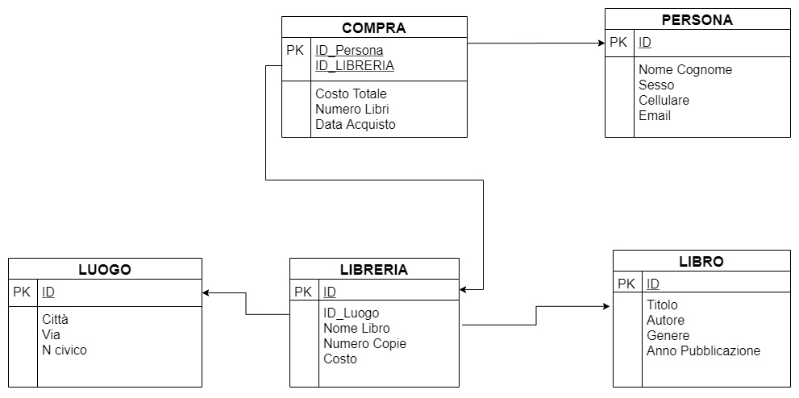
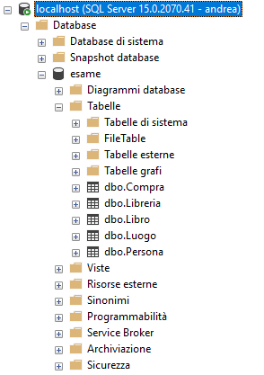
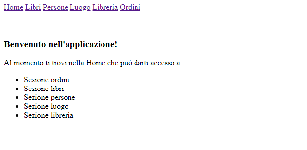
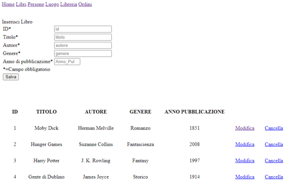
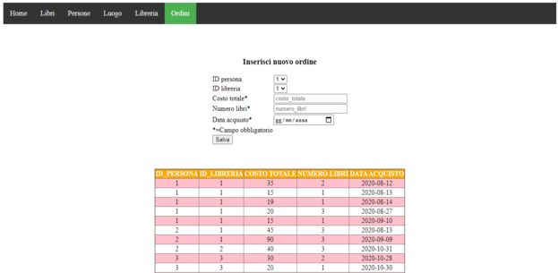

# Progetto di Ingegneria del Software Avanzata

### Introduzione
Il progetto consiste nella realizzazione di una Web-App per la gestione di diverse librerie. Nello specifico sono state implementate le seguenti funzionalità:

  - Inserimento, modifica e cancellazione dei libri disponibili per l'inserimento in una data libreria
  - Inserimento, modifica e cancellazione delle librerie con particolare riferimento alla locazione delle stesse e dei libri disponibili.
  - Inserimento, modifica e cancellazione dei clienti interessati ad effettuare ordini presso le diverse librerie.
  - Realizzazione di ordini con riferimento ai libri acquistati, alla libreria d'interesse e al cliente che li ha originati.

  
### Diagramma ER


### Requisiti
Affinchè il progetto funzioni è necessario importare il database "db.bacpac" all'intero del software Microsoft SQL Server Management Studio ed abilitare il protocollo TCP/IP come spiegato dalla seguente [guida]. Solo sucessivamente è possibile avviare il progetto tramite IDE. Di seguito viene presentata la struttura del database "esame" alla base del progetto.<br>


### Struttura del Progetto
Il progetto è realizzato nel pieno rispetto del pattern Model-view-controller (MVC) caratterizzato da un model che fornisce i metodi utili per l'accesso all'applicazione, una view che si occupa della visualizzazione dei dati contenuti nel model e dell'interazione con l'utente ed infine un controller che riceve i comandi dell'utente andando a modificare gli altri componenti.

L'intero sistema inoltre adotta un'approccio REST basato sui metodi:

  - GET: per ricevere l'elenco di risorse disponibili (libri,librerie,luoghi,ordini e persone).
  - PUT: per l'inserimento di nuove risorse.
  - POST: per l'aggiornamento di risorse esistenti.
  - DELETE: per la cancellazione di risorse non più necessarie.

### Funzionamento del Progetto
All'avvio viene avviato il framework Spring Boot che si fa carico della corretta cooperazione tra front-end e back-end. Nello specifico in termini di front-end vengono gestiti tutti i comandi forniti dall'utente attraverso le pagine html. 
Ben più complessa invece risulta la parte di back-end che si occupa in primis di stabilire una connessione col database attraverso un file "application.properties" per poi andare a comunicare con gli elementi del database (tabelle) mediante l'implementazione delle corrispettive classi. 
Per ogni classe vengono quindi definite delle variabili corrispondenti agli attributi della tabella contenuta nel database ed una serie di metodi che definiscono quali comportamenti sono applicabili alle classi.
L'elemento di congiunzione tra front-end e back-end è la classe "Controller.java" che, data una pagina web all'utente, si occupa di gestire le operazione ad essa associata.

### Strumenti utilizzati
Si è scelto di utilizzare i seguenti strumenti:

* [Maven] - Per la gestione di dipendenze software.
* [NetBeans V12.1] - Ambiente di sviluppo flessibile e ben supportato.
* [Microsoft SQL Server Management Studio 18] - Per la gestione del database.
* [Spring Boot] - Framework per applicazioni Web basate su Java
* [Thymeleaf] - Motore di template, realizza la parte View di un Model-view-controller
* [Junit 5] - Per eseguire test lato model
* [Selenium] - Per eseguire test sul patten MVC

### TEST
Il progetto è correlato da unit test ed integration test.
I primi sono stati realizzati attraverso Junit5 e si occupano di effettuare test (basati su proprietà) automatizzati relativi a metodi GET definiti nella classi del model. A questo scopo sono state definite una serie di classi contenute nel package "utils" che consentano di generare stringhe e numeri randomici.
L'integration test invece è realizzato attraverso il framework Selenium: si occupa di simulare il comportamento dell'utente attraverso il browser web (Google Chrome) spostandosi tra le pagine web, inserendo dati e interrogando il database.

### Documentazione
La documentazione è stata realizzata col comando:
```sh
$ maven site
```
Ed è possibile trovarla all'interno della cartella "docs" insieme alle api.


### Da implementare

 - Modifica e cancellazione di ordini
 - Definizione di nuovi test sia di unità che d'integrazione
 - Utilizzo di CSS per rendere GUI più user-friendly
 
 ## Schermate di esempio
 #### Schermata Home
<kbd></kbd>

 #### Schermata Libri
<kbd></kbd>
 #### Schermata Ordini
<kbd></kbd>

[//]: # (These are reference links used in the body of this note and get stripped out when the markdown processor does its job. There is no need to format nicely because it shouldn't be seen. Thanks SO - http://stackoverflow.com/questions/4823468/store-comments-in-markdown-syntax)


   [Maven]: <https://maven.apache.org/>
   [NetBeans V12.1]: <https://netbeans.org/>
   [Microsoft SQL Server Management Studio 18]: <https://docs.microsoft.com/it-it/sql/ssms/download-sql-server-management-studio-ssms?view=sql-server-ver15>
   [Spring Boot]: <https://spring.io/projects/spring-boot>
   [Thymeleaf]: <https://www.thymeleaf.org/>
   [Junit 5]: <https://junit.org/junit5/>
   [Selenium]: <https://www.selenium.dev/>
   [guida]: <https://store.oceansystems.com/knowledgebase/quickdme-faqs/sql-server-sql-express/configure-sql-express-server-host-enable-tcp-ip-firewall-settings/>
   

   
   
   
   
   
